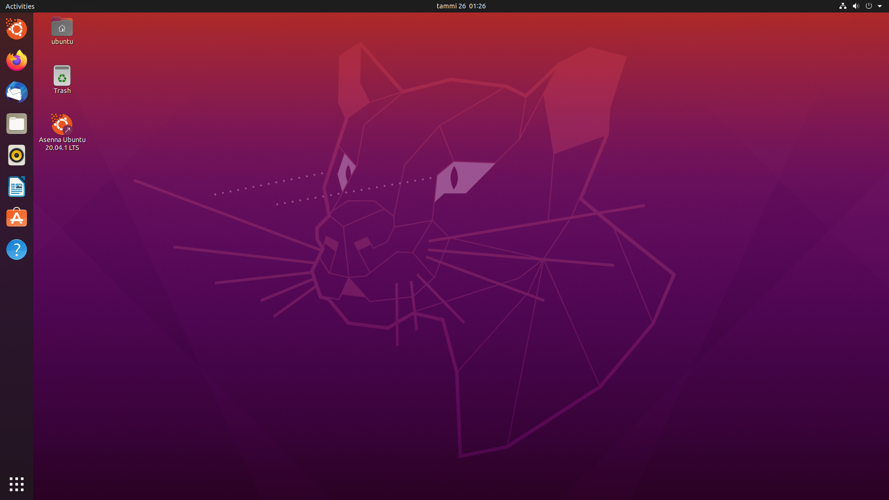
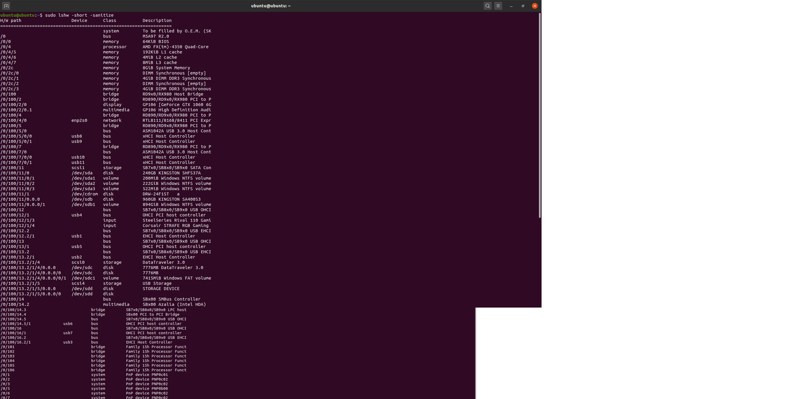
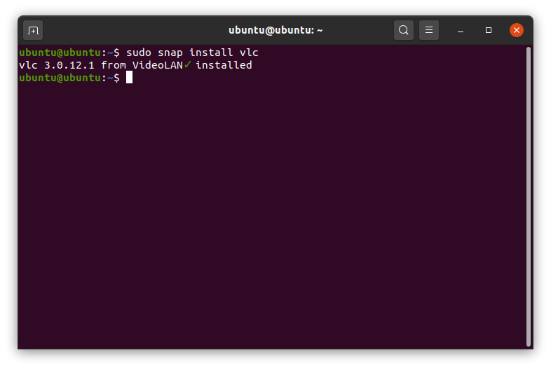
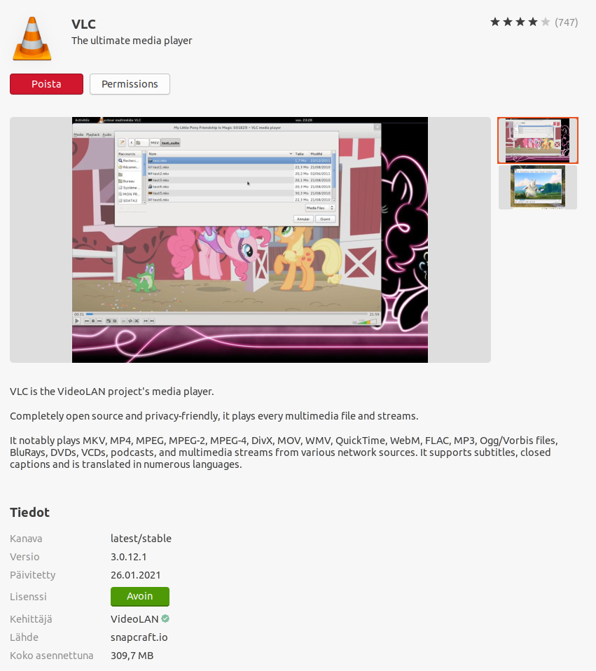
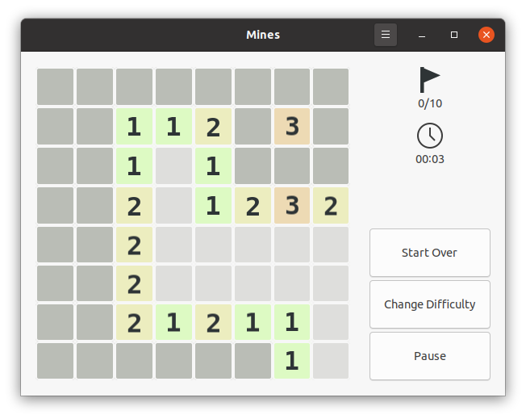
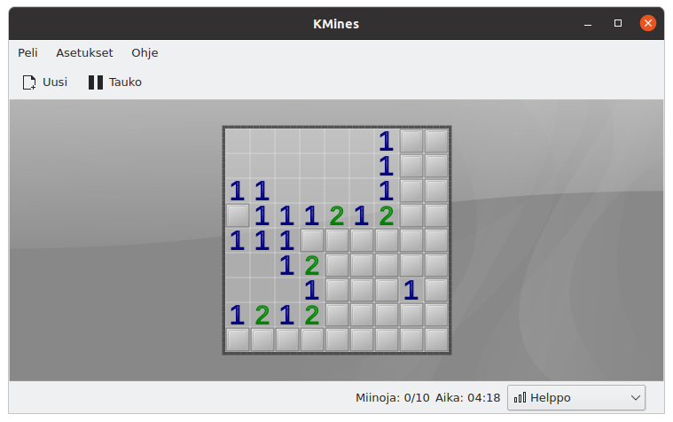
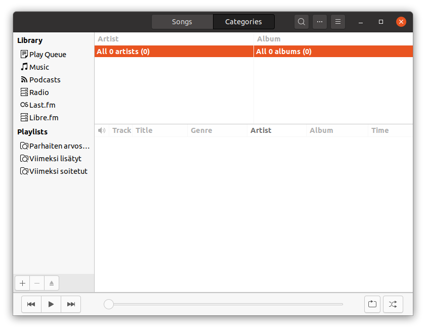
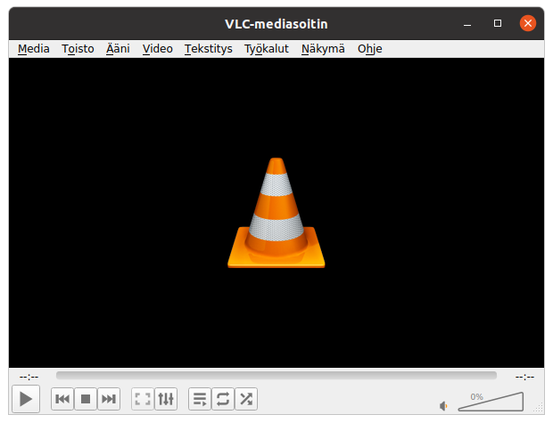
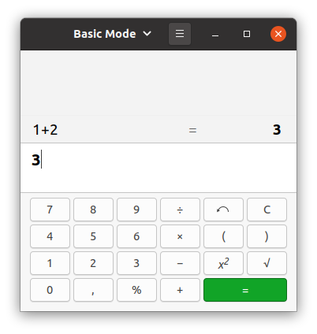
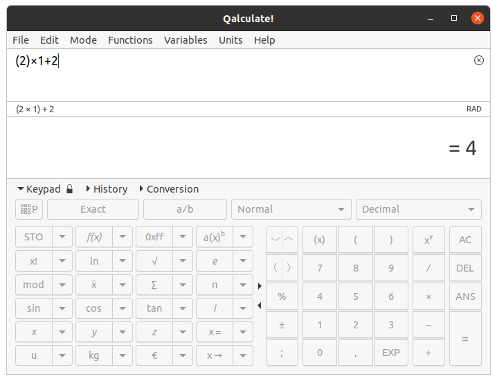

# h1 | Joonas Kulmala

## Table of Contents

- [h1 | Joonas Kulmala](#h1--joonas-kulmala)
  - [Table of Contents](#table-of-contents)
  - [Exercise goals and enviroment](#exercise-goals-and-enviroment)
  - [Prerequisities](#prerequisities)
  - [Exercises](#exercises)
    - [a) Linux live USB](#a-linux-live-usb)
      - [Linux OS](#linux-os)
      - [Rufus](#rufus)
      - [Rufus setup](#rufus-setup)
      - [Rufus logs](#rufus-logs)
      - [Booting USB drive from BIOS](#booting-usb-drive-from-bios)
    - [b) List device hardware](#b-list-device-hardware)
    - [c)  Installing and comparing software](#c--installing-and-comparing-software)
      - [GNOME Mines (preinstalled), KMines (downloaded)](#gnome-mines-preinstalled-kmines-downloaded)
      - [Rhytmbox (preinstalled), VLC media player (downloaded)](#rhytmbox-preinstalled-vlc-media-player-downloaded)
      - [Calculator (preinstalled), Qalculate! (downloaded)](#calculator-preinstalled-qalculate-downloaded)
    - [d) Software licences](#d-software-licences)
    - [e) Tested software and its Windows equivalent](#e-tested-software-and-its-windows-equivalent)
  - [Final thoughts](#final-thoughts)
  - [Sources](#sources)
  - [Edit History](#edit-history)

## Exercise goals and enviroment

The goal of **h1** was to create a bootable USB drive for Linux, launch it, use the terminal to list working hardware and finally try out some applications & verify their licences.

Since I already had Linux on my work laptop, more precisely dual-booting Windows 10 and Ubuntu 20.14, I was more or less familiar with the procedure having completed it on multiple occasions.

I completed the exercise at home in Alppila, Helsinki. I initially started working around 23.00, slowly completing tasks. I used my work laptop with dual-boot to create the USB boot drive, then tested it on my moderately powerful gaming PC. I'd say the whole ordeal took me around 3 hours in total.

## Prerequisities

To replicate this exercise you will need a computer without any specific hardware, an Internet connection to download Linux Ubuntu distribution and USB drive with roughly 2.6 GB storage capabilities. Note that the USB drive will be wiped clean during the procedure.

Rufus requires Windows 7 or newer version.

## Exercises

### a) Linux live USB

#### Linux OS

For this exercise I chose Ubuntu 20.14 as my Linux distribution. Download for free is available [here](https://ubuntu.com/#download).

#### Rufus

Rufus is a free application for creating bootable USB drives. Download for free is available [here](https://rufus.ie/).

#### Rufus setup

Once I had downloaded & installed everything needed the actual procedure turned out to be quite simple. Using Rufus UI I selected USB drive, browsed for Ubuntu ISO image file and simply hit 'START'. The process took approximately 10 minutes to finish. Once done I unplugged the USB drive from laptop, inserted into my PC and navigated to BIOS.


#### Rufus logs

Going through the logs I could see the moment USB drive was inserted; no restarting or manually selecting was required. The log file is available [here](https://github.com/JoonasKulmala/Linux-Server-course/blob/main/Week%201/Resources/rufus.log).


#### Booting USB drive from BIOS

I inserted the USB drive into my PC and navigated to BIOS by restarting the system 3 times before managing to press the right key (it was `F2`). Just can't seem to remember it despite having visited BIOS a thousand times over the years...

In order to launch Ubuntu I had to swap the boot order.


My boot was successful and Ubuntu was up and running!



### b) List device hardware

Using this terminal command I listed the hardware of my PC.

```bash
$ sudo lshw -short -sanitize
```



### c)  Installing and comparing software

Now it was time to try out software running on Linux. I tested installing some using both Terminal & Software GUI. In all 3 cases the former (marked as `preinstalled`) application was preinstalled alongside with this particular version of Ubuntu, while the latter (`downloaded`)was manually downloaded by yours truly.


&nbsp;&nbsp;&nbsp;&nbsp;


#### GNOME Mines (preinstalled), KMines (downloaded)

The iconic Minesweeper comes in many forms, and as it turns out, operating systems!




#### Rhytmbox (preinstalled), VLC media player (downloaded)

Rhytmbox comes preinstalled with this Linux distro, but I prefer my trusty VLC media player. Sadly I had no music tracks so I skipped testing for these two. I did however try OS SFX to make sure all my drivers were working.




#### Calculator (preinstalled), Qalculate! (downloaded)

I'm fairly sure every OS out there comes with a calculator. In Ubuntu 20.14 it was called, well, Calculator. I wanted to install more advanced software for my imaginary math problems, though. Qalculate! seemed to be a good choice.




### d) Software licences

Linux ecosystem is no stranger to the concepts of *free* and *open source*, and the licences in **each of my tested software** reflect this. All 6 applications were operating under [GPL-3.0](https://www.gnu.org/licenses/gpl-3.0.en.html) licence. What this means is that each user is able to use, modify & share software with little limits or regulations, provided they keep track of changes in source files. It also ensures that further developed software must also release under the same licence.

### e) Tested software and its Windows equivalent

- Gnome mines, KMines (Linux) - Minesweeper (Windows). Category: video game
- Rhytmbox, VLC media player (Linux) - Windows media player, VLC media player (Windows). Category: Audio & media playback
- Calculator, Qalculate! (Linux) - Calculator (Windows). Category: Utility tool

## Final thoughts

Since this wasn't my first time installing and using Linux the exercise seemed rather easy for me. I've been using multiple distributions for quite some time, mostly Linux Ubuntu. I'm familiar with some basic terminal commands but nothing too advanced.

## Sources

Tero Karvinen - [h1](https://terokarvinen.com/2020/linux-palvelimet-2021-alkukevat-kurssi-ict4tn021-3014/#h1)

Rufus - [Create bootable USB drives the easy way](https://rufus.ie/)

Linux Ubuntu - [Home](https://ubuntu.com/)

Markdown - [Basix syntax](https://www.markdownguide.org/basic-syntax/)

## Edit History

15.03.2021

- Format `README` for better readability (rename tasks, restructure document)
- Add source links
- Add *final thoughts*
