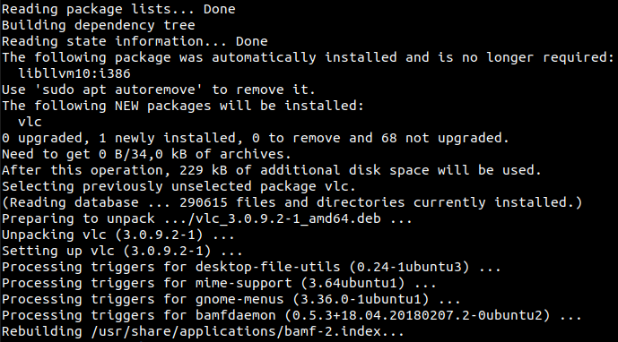
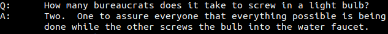
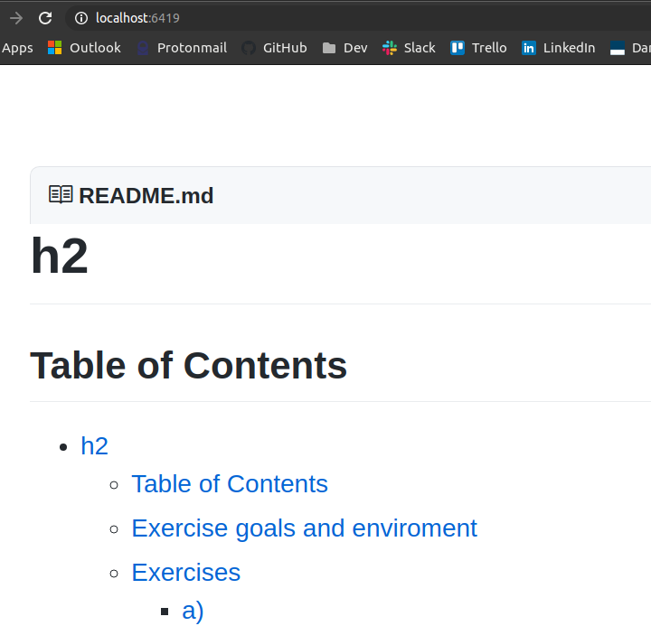

# h2 | Joonas Kulmala

## Table of Contents

- [h2 | Joonas Kulmala](#h2--joonas-kulmala)
  - [Table of Contents](#table-of-contents)
  - [Exercise goals and enviroment](#exercise-goals-and-enviroment)
  - [Exercises](#exercises)
    - [a) Logs](#a-logs)
      - [Log from succesful command](#log-from-succesful-command)
      - [Log from unsuccessful command](#log-from-unsuccessful-command)
    - [b) apt-get](#b-apt-get)
    - [c)](#c)
      - [fortune](#fortune)
      - [Grip](#grip)
      - [Pip](#pip)
    - [Final thoughts](#final-thoughts)
  - [Sources](#sources)
  - [Edit History](#edit-history)

## Exercise goals and enviroment


The goal of **h2** was to learn & practice the use of Terminal in Linux OS. For starters you've got some very basic commands such as ```pwd```, ```cd``` and ```echo```.

The assignments can be found from Tero Karvinen's site [here](https://terokarvinen.com/2020/linux-palvelimet-2021-alkukevat-kurssi-ict4tn021-3014/#h2). Only items **a**, **b** and **c** will be reported here.

## Exercises

### a) Logs

I'll try causing some entries to log file named `syslog` by establishing SSH connection to my virtual server from my home laptop, both existing & nonexisting user. We should be seeing entries from both attempts.

#### Log from succesful command

Let's start with a succesful SSH connection. Note that I've blanked/swapped personal details for generic names:

```bash
$ ssh username@hostname
# Enter private SSH key
# Mar 15 18:45:45 hostname sshd[151091]: Accepted publickey for <USERNAME> from <MY_HOSTNAME> port 44548 ssh2: <PUBLIC_KEY>
# Mar 15 19:02:13 <HOSTNAME> sshd[151093]: Disconnected from user <USERNAME> <MY_HOSTNAME> port 44548
```
After entering my private SSH key counterpart and the remote server accepting it a connection was succesfully established. Terminating the connection also leaves a log entry.

#### Log from unsuccessful command
 
 Let's repeat the process above but this time user an incorrect, nonexisting username to login.

 ```bash
$ ssh WRONG-USER@hostname
# WRONG-USER@hostname: Permission denied (publickey).
 ```

 Since **WRONG-USER** does not exist on the remote server, login is not possible.

 ```bash
# Mar 15 19:07:00 hostname sshd[151177]: Invalid user WRONG-USER from <MY_HOSTNAME> port 44720
# Mar 15 19:07:00 hostname sshd[151177]: Connection closed by invalid user WRONG-USER <MY_HOSTNAME> port 44720 [preauth]
```

### b) apt-get

Let's try installing a program via Terminal. **A**dvanced **P**ackage **T**ool, APT for short is used to handle installing, updating and removing software on selected Linux distributions such as our `Ubuntu 20.14`. There are other package tools aswell, for example `pip` and `npm`. We'll also be requiring `sudo` rights for this action.

I chose to install the popular **VLC** multimedia player.

```bash
$ sudo apt-get install vlc
```

A prompt to enter user's password appeared, courtesy of using `sudo`.



Judging by the existing packages I must've had VLC installed at some point. Nevertheless, installation was a success!

### c)

#### fortune

I started with a funny tool called [fortune](https://wiki.archlinux.org/index.php/Fortune). It's a simple program that when prompted returns random, rather pointless made-up fortunes, quotes et cetera. The description reads `provides fortune cookies on demand`.

```bash
$ sudo apt-get install fortune
```

Once installed the basic command was, well, ```$ fortune```. It returned the following:



#### Grip

[Grip](https://github.com/joeyespo/grip) is a tool that renders local README files in localhost, allowing you to preview them without publishing on e.g. GitHub.

```bash
$ pip install grip
```
```bash
$ cd myrepo
$ grip
 * Running on http://localhost:6419/
 ```


I instantly fell in love with this tool! A bad habit of mine is making constant mini-pushes in order to fix minor typos or preview the changes, and now I won't have to `git commit` for each little change.

#### Pip

[Pip](https://pypi.org/project/pip/) is a package installer for Python. A necessary tool for Python developers, it works pretty much the same as any other package installer really. Pip comes installed alongside with Python but is available for manual installation aswell.

```bash
curl https://bootstrap.pypa.io/get-pip.py -o get-pip.py
```

```bash
$ pip --version
# pip 20.0.2 from /usr/lib/python3/dist-packages/pip (python 3.8)
```

### Final thoughts

Terminal is a vital tool for any Linux user, and commands can range from basic functions such as changing directories to fully fledged applications requiring no GUI at all to use.

That's all for now. See you next week in **h3**!

## Sources

Tero Karvinen - [h2](https://terokarvinen.com/2020/linux-palvelimet-2021-alkukevat-kurssi-ict4tn021-3014/#h2)

Tero Karvinen - [Command Line Basics Revisited](https://terokarvinen.com/2020/command-line-basics-revisited/)

Linux - [Viewing Linux Logs from the Command Line](https://www.linux.com/topic/desktop/viewing-linux-logs-command-line/)

## Edit History

15.03.2021

- Recomplete task **a**
- Format `README` for better readability (rename tasks, restructure document)
- Add source links


