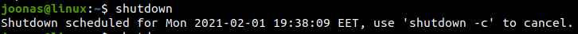
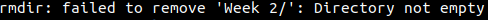
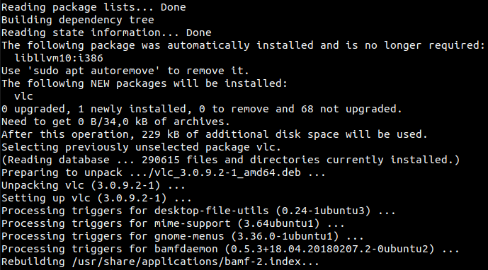

# h2

## Table of Contents

- [h2](#h2)
  - [Table of Contents](#table-of-contents)
  - [Exercise goals and enviroment](#exercise-goals-and-enviroment)
  - [Exercises](#exercises)
    - [a)](#a)
      - [Successful command](#successful-command)
      - [Unsuccessful command](#unsuccessful-command)
    - [b)](#b)
    - [c)](#c)
      - [fortune](#fortune)
      - [Grip](#grip)
      - [Pip](#pip)
    - [Final thoughts](#final-thoughts)

## Exercise goals and enviroment


[Source](https://www.reddit.com/r/ProgrammerHumor/comments/93t8ie/linux_irl/):

The goal of **h2** was to learn & practice the use of Terminal in Linux OS. For starters you've got some very basic commands such as ```pwd```, ```cd``` and ```echo```.

The assignments can be found from Tero Karvinen's site [here](https://terokarvinen.com/2020/linux-palvelimet-2021-alkukevat-kurssi-ict4tn021-3014/#h2). Only items **a**, **b** and **c** will be reported here.

## Exercises

### a)
#### Successful command

Say we're finishing for the day and wish to shutdown our machine. A successful way to perform this using the Terminal could look like this
```bash
$ shutdown
```
The command was executed successfully and the following was returned:



The system is now due to shutdown in, by default, 60 seconds. It is possible to specify target time with ```shutdown n```. You can also cancel the command with ```shutdown -c```.

#### Unsuccessful command

Say we wanted to delete this week's exercise folder which is named `Week 2`. The folder is not empty as it contains this particular `README.md` file as well as `Screenshots` folder with additional files.

```bash
$ rmdir Week 2
```

The command failed, returning the following:



This is because the command we gave only allows deleting ***empty*** directories whereas 

### b)

Let's try installing a program via Terminal. **A**dvanced **P**ackage **T**ool, APT for short is used to handle installing, updating and removing software on selected Linux distributions such as our `Ubuntu 20.14`. There are other package tools aswell, for example `pip` and `npm`. We'll also be requiring `sudo` rights for this action.

I chose to install the popular **VLC** multimedia player.

```bash
$ sudo apt-get install vlc
```

A prompt to enter user's password appeared, courtesy of using `sudo`.



Judging by the existing packages I must've had VLC installed at some point. Nevertheless, installation was a success!

### c)

#### fortune

I started with a funny tool called [fortune](https://wiki.archlinux.org/index.php/Fortune). It's a simple program that when prompted returns random, rather pointless made-up fortunes, quotes et cetera. The description reads `provides fortune cookies on demand`.

```bash
$ sudo apt-get install fortune
```

Once installed the basic command was, well, ```$ fortune```. It returned the following:

[fortune](Screenshots/fortune.png)

#### Grip

[Grip](https://github.com/joeyespo/grip) is a tool that renders local README files in localhost, allowing you to preview them without publishing on e.g. GitHub.

```bash
$ pip install grip
```
```bash
$ cd myrepo
$ grip
 * Running on http://localhost:6419/
 ```
[Grip](Screenshots/grip.png)

I instantly fell in love with this tool! A bad habit of mine is making constant mini-pushes in order to fix minor typos or preview the changes, and now I won't have to `git commit` for each little change.

#### Pip

[Pip](https://pypi.org/project/pip/) is a package installer for Python. A necessary tool for Python developers, it works pretty much the same as any other package installer really. Pip comes installed alongside with Python but is available for manual installation aswell.

```bash
curl https://bootstrap.pypa.io/get-pip.py -o get-pip.py
```

```bash
$ pip --version
```
```pip 20.0.2 from /usr/lib/python3/dist-packages/pip (python 3.8)```

### Final thoughts

Terminal is a vital tool for Linux users, and commands can range from basic utility tools to fully fledged applications requiring no GUI to use.

That's all for now. See you next week in **h3**!


