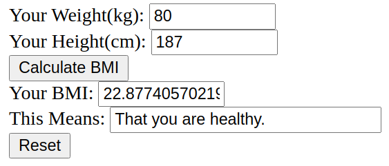

# h3 | Joonas Kulmala

- [h3 | Joonas Kulmala](#h3--joonas-kulmala)
  - [Exercise goals and enviroment](#exercise-goals-and-enviroment)
  - [Exercises - 5 of personal choice](#exercises---5-of-personal-choice)
    - [a) Example page](#a-example-page)
    - [b) Apache2 log entries](#b-apache2-log-entries)
      - [Successful (200)](#successful-200)
      - [Unsuccessful (404)](#unsuccessful-404)
    - [d) Apache error](#d-apache-error)
    - [f) BMI calculator](#f-bmi-calculator)
    - [h) New defalt homepage](#h-new-defalt-homepage)
  - [Final thoughts](#final-thoughts)
  - [Sources](#sources)
  - [Edit History](#edit-history)

## Exercise goals and enviroment

This week we began actual server programming using the most popular web server, [Apache](https://httpd.apache.org/).

For more information about *HTTP response codes* you should head [here](https://developer.mozilla.org/en-US/docs/Web/HTTP/Status) and for *HTTP request methods* [here](https://developer.mozilla.org/en-US/docs/Web/HTTP/Methods).

The exercises can be found from Tero Karvinen's [site](https://terokarvinen.com/2020/linux-palvelimet-2021-alkukevat-kurssi-ict4tn021-3014/#h3).

## Exercises - 5 of personal choice

### a) Example page

To begin we needed to install Apache2 server tools.

```bash
$ sudo apt-get -y install apache2
```

I navigated to *localhost* and was met with the Apache2 default page, confirming successful server setup.


Now for the primary task: creating my own basic webpage and making it look about like [this](http://example.com/~tero).

I opened the terminal and created a directory with a static page using the [template](index.html) above

```bash
$ mkdir public_html
$ cd public_html/
$ touch index.html
$ nano index.html
```
To access this resource I needed to navigate to *localhost/~user*, replacing *user* with my actual username. To find it out I used *whoami* command:

```bash
$ echo whoami
# user
```


### b) Apache2 log entries

My server was up and running locally. I wanted to log one successful and unsuccessful HTTP event in the `.apache2/access.log` file.

#### Successful (200)

This one's very simple to get: once the server was up I simply navigated to *localhost/~user* to check my newly set up home page. The following was logged:

```bash
::1 - - [09/Feb/2021:08:21:12 +0200] "GET /~user/ HTTP/1.1" 200 987 "-" "Mozilla/5.0 (X11; Linux x86_64) AppleWebKit/537.36 (KHTML, like Gecko) Chrome/87.0.4280.141 Safari/537.36"
```

It read the date & time of the event, HTTP method `GET` response with response code `200` and a bunch of browser compatibility information we're not interested at this time.

#### Unsuccessful (404)

This one wasn't hard to get either. The easiest way, knowing my server had no additional pages or resources yet added, was to try navigating to a nonexistent page. Therefor I tried navigating to localhost/~user/_help_ and the following was logged:

```bash
::1 - - [09/Feb/2021:08:34:57 +0200] "GET /~user/help HTTP/1.1" 404 488 "-" "Mozilla/5.0 (X11; Linux x86_64) AppleWebKit/537.36 (KHTML, like Gecko) Chrome/87.0.4280.141 Safari/537.36"
```

Same structure as above but this time with the HTTP response code `404`, a familiar sight to anyone who's ever been on the Internet. It indicates that a resources is temporarily or permanently unreachable.

### d) Apache error

I wanted to see how the server would react if I commented out some lines of code from important config files:

```bash
$ cd /etc/apache2/sites-available
$ sudoedit virtualjoonas.conf
```

Then I commented out the second line and restarted the server with **$ sudo service apache2 restart**:

```
## /etc/apache2/sites-enabled/virtualjoonas.conf
# <VirtualHost *:80>
 DocumentRoot /home/virtualjoonas/public_html/
 <Directory /home/virtualjoonas/public_html/>
   Require all granted
 </Directory>
</VirtualHost>
```

The server naturally crashed. I navigated to `syslog` file to see the results:

```bash
$ cd /var/log
$ nano syslog
```

And read these entries:s

```bash
Mar 15 23:26:52 linuxservercoursejoonas systemd[1]: Starting The Apache HTTP Server...
Mar 15 23:26:52 linuxservercoursejoonas apachectl[151625]: apache2: Syntax error on line 225 of /etc/apache2/apache2.conf: Syntax error on line 7 of /etc/apache2/sites-enabled/virtualjoonas.conf: </Virtual>
Mar 15 23:26:52 linuxservercoursejoonas apachectl[151612]: Action 'start' failed.
Mar 15 23:26:52 linuxservercoursejoonas apachectl[151612]: The Apache error log may have more information.
Mar 15 23:26:52 linuxservercoursejoonas systemd[1]: apache2.service: Control process exited, code=exited, status=1/FAILURE
Mar 15 23:26:52 linuxservercoursejoonas systemd[1]: apache2.service: Failed with result 'exit-code'.
Mar 15 23:26:52 linuxservercoursejoonas systemd[1]: Failed to start The Apache HTTP Server.
```

### f) BMI calculator

A simple BMI calculator running on the localhost server. The Javascript code comes from [Proglogic](https://www.proglogic.com/code/javascript/calculator/bmi.php).

```bash
$ cd public_html
$ touch bmi.html
$ nano bmi.html
```

Pasting [this code](bmi.html) and navigating to *localhost/~user/bmi* (no `~/user/` required after next task) loaded the BMI calculator.



### h) New defalt homepage

Navigating to *localhost* displays Apache2 default welcome page. I am going to change that to display my personal page.

To begin I created a new page to display

```bash
$ sudoedit /etc/apache2/sites-available/user.conf
```

and pasted this snippet

```bash
## /etc/apache2/sites-enabled/user.conf
<VirtualHost *:80>
 DocumentRoot /home/user/public_html/
 <Directory /home/user/public_html/>
   Require all granted
 </Directory>
</VirtualHost>
```

Then enabled the new page while disabling default

```bash
$ sudo a2ensite user.conf
$ sudo a2dissite 000-default.conf
```

This required restarting the server

```bash
$ sudo service apache2 restart
```

Now navigating to **localhost** directs to `index.html`, no *~/user* required. This also applied to previously created BMI calculator.

## Final thoughts

Overall I found this week's topic quite interesting.

Learning Linux is going relatively well too. I've been using terminal as opposed to GUI as much as possible to learn how to use commands to execute more and more tasks.

## Sources

Tero Karvinen - [h3](https://terokarvinen.com/2020/linux-palvelimet-2021-alkukevat-kurssi-ict4tn021-3014/#h3)

Tero Karvinen - [New Default Website with Apache2 – Show your homepage at top of example.com, no tilde](http://terokarvinen.com/2016/new-default-website-with-apache2-show-your-homepage-at-top-of-example-com-no-tilde/index.html)

MDN Web Docs - [HTTP response status codes](https://developer.mozilla.org/en-US/docs/Web/HTTP/Status)

MDN Web Docs - [HTTP request methods](https://developer.mozilla.org/en-US/docs/Web/HTTP/Methods)

Proglogic - [Body Mass Index Calculator](https://www.proglogic.com/code/javascript/calculator/bmi.php)

## Edit History

15.03.2021

- Format `README` for better readability
- Add source links

16.03.2021

- Add task d)
