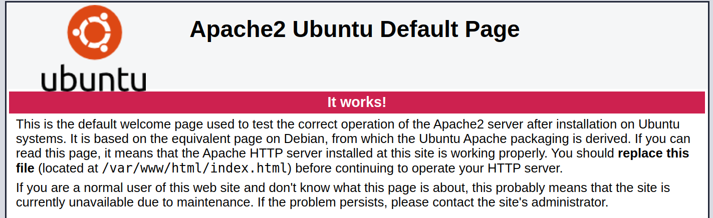
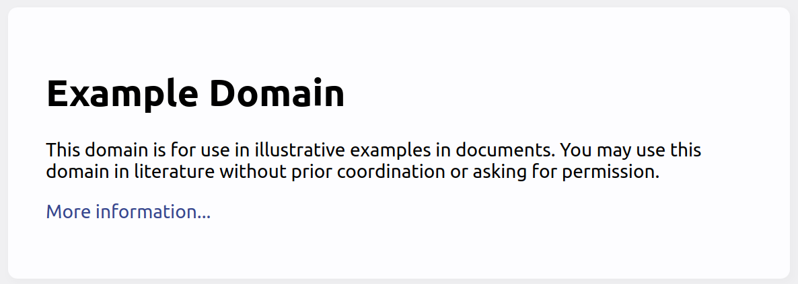

# h3 | Joonas Kulmala

## Exercise goals and enviroment

This week we began actual server programming using the most popular web server, [Apache](https://httpd.apache.org/).

For more information about `HTTP response codes` you should head [here](https://developer.mozilla.org/en-US/docs/Web/HTTP/Status) and for `HTTP request methods` [here](https://developer.mozilla.org/en-US/docs/Web/HTTP/Methods).

The exercises can be found from Tero Karvinen's [site](https://terokarvinen.com/2020/linux-palvelimet-2021-alkukevat-kurssi-ict4tn021-3014/#h3).

## Exercises - 5 of own choice

### a)

To begin we needed to install Apache2 server tools.

```bash
$ sudo apt-get install apache2
```

I navigated to `localhost` and was met with the Apache2 default page, confirming successful server setup.



Now for the primary task: creating my own basic webpage and making it look about like [this](http://example.com/~tero).

I opened the terminal and created a directory with a static page using the [template](index.html) above

```bash
$ mkdir public_html
$ cd public_html/
$ touch index.html
$ nano index.html
```
To access this resource I needed to navigate to `localhost/~user`, replacing *user* with my actual username. To find it out I used `whoami` command:

```bash
$ echo whoami
# joonas
```



### b)

My server was up and running locally. I wanted to log one successful and unsuccessful HTTP event in the `.apache2/access.log` file.

#### Successful (200)

This one's very simple to get: once the server was up I simply navigated to *localhost/~joonas* to check my newly set up home page. The following was logged:

`::1 - - [09/Feb/2021:08:21:12 +0200] "GET /~joonas/ HTTP/1.1" 200 987 "-" "Mozilla/5.0 (X11; Linux x86_64) AppleWebKit/537.36 (KHTML, like Gecko) Chrome/87.0.4280.141 Safari/537.36"`

It read the date & time of the event, HTTP method `GET` response with response code `200` and a bunch of browser compatibility information we're not interested at this time.

#### Unsuccessful (404)

This was wasn't hard to get either. The easiest way, knowing my server had no additional pages or resources yet added, was to try navigating to a nonexistent page. Therefor I tried loading localhost/~joonas/*help* and the following was logged:

`::1 - - [09/Feb/2021:08:34:57 +0200] "GET /~joonas/help HTTP/1.1" 404 488 "-" "Mozilla/5.0 (X11; Linux x86_64) AppleWebKit/537.36 (KHTML, like Gecko) Chrome/87.0.4280.141 Safari/537.36"`

Same structure as above but this time with the HTTP response code `404`, a familiar sight to anyone who's ever been on the Internet. It indicates that a resources is temporarily or permanently unreachable.

### f)

### g)

### i)

## Summary
