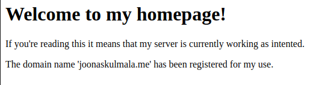
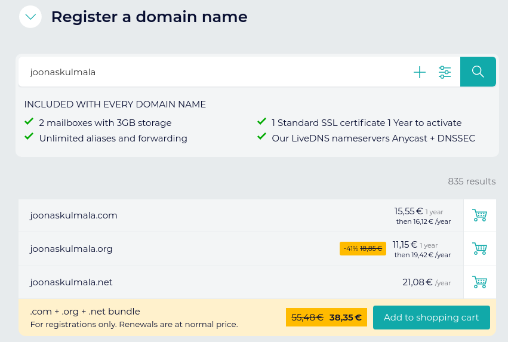
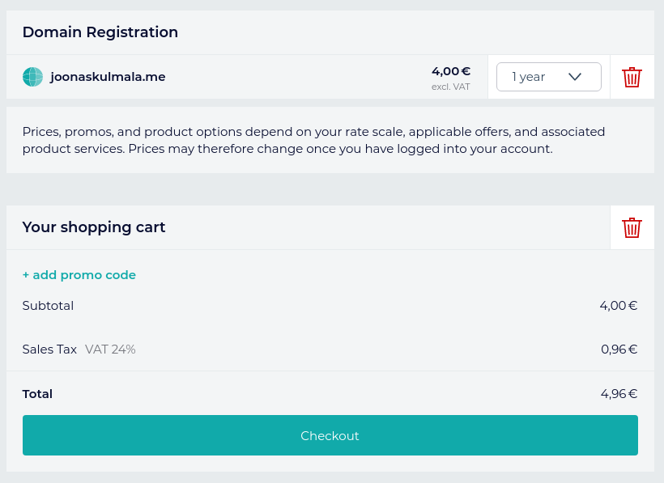
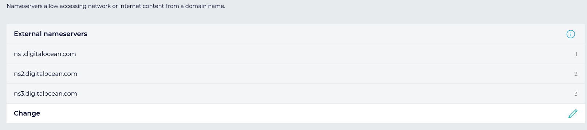
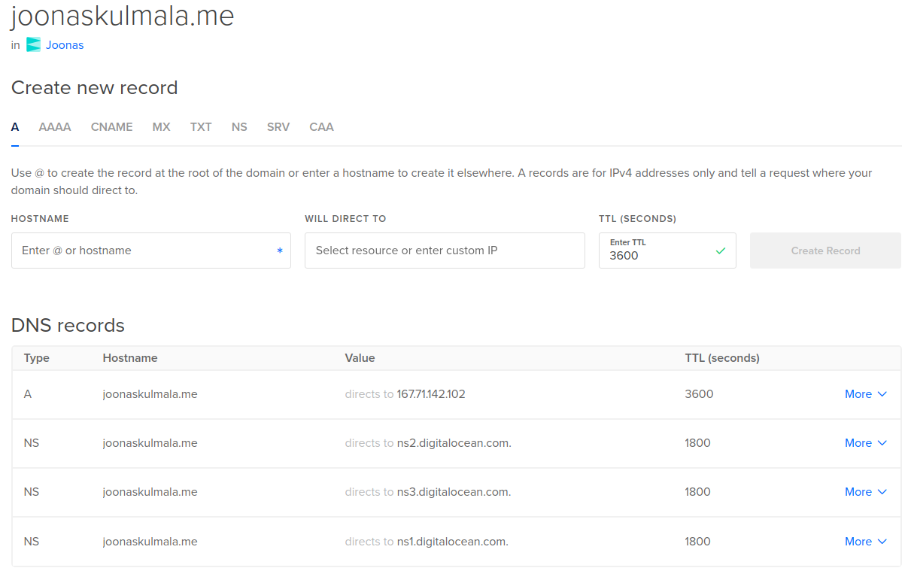
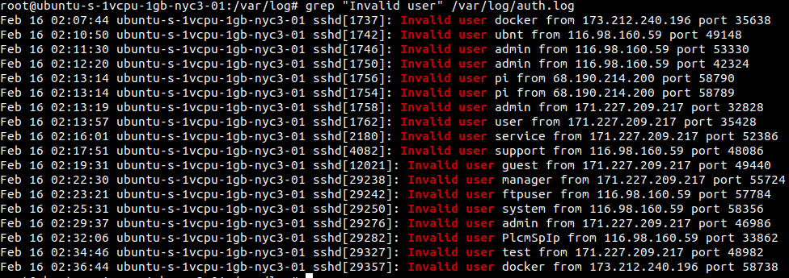
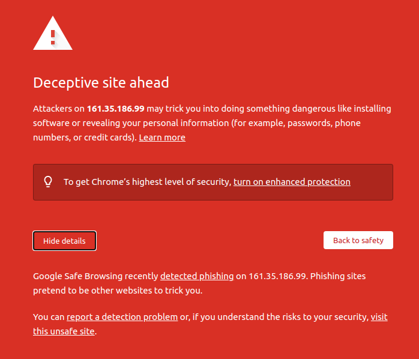

# h4 | Joonas Kulmala

- [h4 | Joonas Kulmala](#h4--joonas-kulmala)
  - [Exercise goals and enviroment](#exercise-goals-and-enviroment)
  - [Exercises](#exercises)
    - [a) Setting up your server](#a-setting-up-your-server)
      - [Creating a Droplet](#creating-a-droplet)
      - [Testing SSH connection](#testing-ssh-connection)
      - [Creating sudo user and removing root & password login](#creating-sudo-user-and-removing-root--password-login)
      - [Apache2, static homepage](#apache2-static-homepage)
      - [Purchasing domain name](#purchasing-domain-name)
    - [b) Analyzing invading attempts from logs](#b-analyzing-invading-attempts-from-logs)
    - [Final thoughts](#final-thoughts)

## Exercise goals and enviroment

In week 4 we learned how to setup a virtual server using cloud services and how & where to purchase a domain name.

I setup the server using [DigitalOcean](https://www.digitalocean.com/)'s platform. Registration fee was 5 USD; up to 3 static websites can be hosted for free. I also received 100 USD platform credits, courtesy of GitHub Education program.

Domain names can be purchased from multiple online vendors. I went with [Gandi](https://www.gandi.net/en).

As always you can find exercise details on Tero's [website](https://terokarvinen.com/2020/linux-palvelimet-2021-alkukevat-kurssi-ict4tn021-3014/#h4).

## Exercises

This exercise will result in a Linux server running virtually. The domain name is [http://joonaskulmala.me/](http://joonaskulmala.me/). Should be domain registration fail or be delayed the raw IPv4 address is [167.71.142.102](http://167.71.142.102/).

### a) Setting up your server

#### Creating a Droplet

DigitalOcean's virtual servers are called **Droplets**. For the Linux version I went with the same as my current distribution, *Ubuntu 20.14 x64*. Basic plan, default resources and the closest possible server location.


I also did [SSH](https://www.ssh.com/ssh/) key configuration (although this would cause a small issue on personal behalf later on).

#### Testing SSH connection

The newly created server was up and running in just a few minutes. Now it was time to test SSH connection. By default there are no created users so we'll have to login as `root` and configure some users later on.

```bash
$ ssh root@server
```

Login to the remote server was successful. I did some basic setups to **UFW** firewall and updated packages using **ATP**.

```bash
$ sudo ufw allow 22/tcp
$ sudo ufw enable

$ sudo apt-get update
$ sudo apt-get upgrade
```
#### Creating sudo user and removing root & password login

Now, since we shouldn't be using root access all the time and also because we might have multiple people accessing the server, I am going to create one user with sudo rights and then disable root login. Furthermore, I will be disabling password login and only allowing ssh connection (you'll see why in **b) part).

```bash
$ sudo adduser user
$ sudo adduser user sudo
$ sudo adduser user adm
$ sudo adduser user admin
```

Now that we have a user with sufficient rights I am going to disable root & user password login and only rely on ssh.

Root login disable:
```bash
$ sudo usermod --lock root
```

Password login disable:
```bash
$ sudoedit /etc/ssh/sshd_config
    # ...
    PermitRootLogin no
    # ...
    ChallengeResponseAuthentication no
    # ...
    PasswordAuthentication no
    # ...
    UsePAM no
```

Now, before we restart the server to apply these policies we have to take care of a small matter. See, we've disabled login using password auth. This means that only SSH login is possible.

However, currently the public SSH key is stored only in `root` user's directory. I am gonna going to copy the contents of SSH public key to `user`'s directory.

**Disclaimer:** this is not an elegant way nor is it the most effective method to do this procedure. I just came up with a hack method while debugging this issue.

```bash
# 'User' has no .ssh folder or 'authorized_keys' file in their directory yet, so we will have to create those manually

# Copy the public key from 'root'
$ cd ~/.ssh
$ nano authorized_keys

# Navigate to 'user' .ssh directory
$ cd /home/user/.ssh
$ touch authorized_keys
# Paste the public key here
```

Now to test if we can estabslish SSH connection for our new `User`:

```bash
$ ssh user@server
# Login successful as 'User'
```

#### Apache2, static homepage

[Last week](https://github.com/JoonasKulmala/Linux-Server-course/tree/main/Week%203#a-example-page) we learned how to setup a local server using Apache2. I will repeat the process on the remote server.

```bash
# Install Apache2
$ sudo apt-get install -y apache2
# Repeat the process of changing Default page to custom
```

And voilà, our remote server [167.71.142.102](http://167.71.142.102/) is now accessable publicly!



#### Purchasing domain name

Since nobody could mind to remember each website's **IPv4** (or **IPv6** for that matter) domain names are used to redirect visitors.

Domain name prices range from free to thousands and must be renewed from time to time. I went with [Gandi](https://www.gandi.net/en).





Configuring wasn't as tricky as I expected, or atleast both services offer proper documentation. The domain had to be configured to use **external nameservers**:



And the remote server had to be configured to redirect hostname to IP:




### b) Analyzing invading attempts from logs

Before disabling root login and password login for users I wanted to check the logs for failed remote ssh logins. For my knowledge these are commonly bots trying user/password combinations in order to gain access to a server. The server had been running for roughly 20 minutes at this point. I used the following command to read & write out every line from `auth.log` to check how many failed logins there were so far:

```bash
$ grep "Invalid user" /var/log/auth.log
```



As we can see bots were already hard at work, trying to access the server. It is worth noting how such basic users such as `admin` and `guest` were tried. This is the main reason I disabled password login.

**Bonus!**

While writing this report I recreated the process to double check each step and make sure I didn't miss any steps. While installing Apache2 and navigating to server IP I was met with an alarming message:



Now I have absolutely no idea what caused this. As far as I could tell there's no **successful unauthorized login** to the server. Considering I recreated everything while `root` and was using **SSH** from the beginning I could not figure out the reason for the alert about potential phishing. 

### Final thoughts

This was by far the best exercise so far. Not only did I learn a ton about setting up my own server but also got a keep using *Terminal* and become better one command at a time.