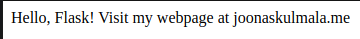

# h5 | Joonas Kulmala

- [h5 | Joonas Kulmala](#h5--joonas-kulmala)
  - [Exercise goals and enviroment](#exercise-goals-and-enviroment)
  - [Exercises](#exercises)
    - [a) Hello Flask!](#a-hello-flask)
    - [b) Production Flask](#b-production-flask)
    - [c) Flask templates](#c-flask-templates)
    - [d) Flask user info](#d-flask-user-info)
  - [Final thoughts](#final-thoughts)
  - [Sources](#sources)
  - [Edit history](#edit-history)

## Exercise goals and enviroment

This week's topic is Flask, a web framework for Python.

The final product is available on my website (from last week) [here](http://joonaskulmala.me/).

As always the exercises & material can be found on **Tero Karvinen**'s [website](https://terokarvinen.com/2020/linux-palvelimet-2021-alkukevat-kurssi-ict4tn021-3014/#h5.)

## Exercises

### a) Hello Flask!

Let's start by making installing the required tools; [Python 3](https://www.python.org/) and [Flask](https://flask.palletsprojects.com/en/1.1.x/).

Python comes preinstalled on many Linux distributions. However, as is always the case, the version might be outdated. Furthermore, there's a major difference between Python 2 and 3. Use the comm12and `python3 --version` to verify your version and install/update if necessary. It is recommended to use virtual enviroment module `venv` for Python projects, however this exercise won't be exploring this topic.

Python
```bash
# python3 --version
$ sudo apt install python3
```

Flask
```bash
$ sudo apt-get -y install python3-flask curl
```

Now onto making a simple Flask application.

```bash
$ cd path/to/app
$ mkdir HelloFlask
$ cd HelloFlask
$ touch HelloFlask.py
```
Simple **Hello Flask** app in python code could look like this:

```bash
from flask import Flask
app = Flask(__name__)
@app.route("/")
def hello():
        return "Hello, Flask! Visit my webpage at www.joonaskulmala.me"
if __name__ == "__main__":
        app.run(debug=True)

```

Now let's run the application and navigate to **localhost port 5000** to see the results:
```bash
$ python3 HelloFlask

 * Serving Flask app "HelloFlask" (lazy loading)
 * Environment: production
   WARNING: This is a development server. Do not use it in a production deployment.
   Use a production WSGI server instead.
 * Debug mode: on
 * Running on http://127.0.0.1:5000/ (Press CTRL+C to quit)
 * Restarting with stat
 * Debugger is active!
 * Debugger PIN: 121-294-270
127.0.0.1 - - [02/Mar/2021 06:02:16] "GET / HTTP/1.1" 200 -
```



### b) Production Flask

For this we'll need Apache server tools from [Week3](https://github.com/JoonasKulmala/Linux-Server-course/tree/main/Week%203) and forward. If you lack Apache use the following command for installation:

Apache
```bash
$ sudo apt-get update
$ sudo apt-get -y install apache2
```

Now onto the main topic, **WSGI**. Install it:

mod_wsgi
```bash
sudo apt-get install libapache2-mod-wsgi-py3
# Restart Apache
$ sudo service apache2 restart
# Check to confirm successful status
$ apache2ctl -M|grep -i wsgi
```


### c) Flask templates

// TO BE ADDED

### d) Flask user info

// TO BE ADDED

## Final thoughts

I encountered some tough obstacles with WSGI, namely running into problems with permissions. This exercise will remain incompleted until I can better grasp the topic and return to fix all the issues.

## Sources

[Flask - Tero Karvinen](http://terokarvinen.com/2017/hello-python-flask-web-app-development-server-install-on-ubuntu-16-04/index.html?fromSearch=)

[WSGI - Tero Karvinen](http://terokarvinen.com/2017/write-python-3-web-apps-with-apache2-mod_wsgi-install-ubuntu-16-04-xenial-every-tiny-part-tested-separately/index.html?fromSearch=)

## Edit history

2.3.2021 Initial commit
