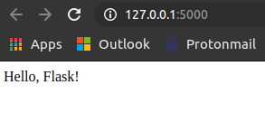

# h7 | Joonas Kulmala

- [h7 | Joonas Kulmala](#h7--joonas-kulmala)
  - [Exercise goals and enviroment](#exercise-goals-and-enviroment)
  - [Exercises](#exercises)
    - [Webbikehitystä](#webbikehitystä)
    - [Työntekijät](#työntekijät)
      - [New employess](#new-employess)
      - [Homepages](#homepages)
    - [Uusi komento](#uusi-komento)
    - [Koodajan koti](#koodajan-koti)
      - [Python](#python)
      - [Bash](#bash)
      - [Node.js](#nodejs)
    - [Etusivun uutinen](#etusivun-uutinen)
    - [Kaksi sivua](#kaksi-sivua)
    - [Etäkäyttöä](#etäkäyttöä)
  - [Excluded exercise tasks](#excluded-exercise-tasks)
  - [Final thoughts](#final-thoughts)
  - [Sources](#sources)
  - [Edit history](#edit-history)

## Exercise goals and enviroment

The goal is to practice for the final task. Here's the exercise:

[Arvioitava laboratorioharjoitus – Linux palvelimet ict4tn021-8 maanantai – alkukevät 2018 – 5 op](http://terokarvinen.com/2018/03/12/arvioitava-laboratorioharjoitus-linux-palvelimet-ict4tn021-8-maanantai-alkukevat-2018-5-op/index.html?fromSearch=)

```bash
## Weppikehitystä
Asenna valitsemasi weppikehityspino. Tee sille esimerkkiohjelma.
* Lue esimerkkiohjelmassasi tietueita tietokannasta.
## Työntekijät
Työntekijöitämme ovat Jorma Mähkylä, Pekka Hurme, Ronaldo Smith, Håkan
Petersson, Einari Mikkonen, Einari Vähäkäähkä, Eija Vähäkäähkä.
Tee kullekin käyttäjälle esimerkkikotisivu.
## Uusi komento
Tee järjestelmään uusi komento 'ipos', joka näyttää tietokoneen
ip-osoitteen. Komennon tulee toimia kaikilla käyttäjillä.
## Koodajan koti
Laita pekan kotihakemistoon 'hei maailma' Pythonilla, Bashilla ja Nodejs
JavaScriptillä.
## Etusivun uutinen
Laita esimerkkinä tekemäsi weppiohjelma näkyviin palvelimen etusivulle.
## Kaksi sivua
Laita koneelle kaksi sivua:
- hellodb.exapmle.com - tekemäsi esimerkkisivu weppikehityspinosta
- kynakoe.example.com - staattinen sivu, jolla lukee "hei kynäkoe"
Voit simuloida nimipalvelimen toimintaa /etc/hosts -tiedoston avulla.
## Robodot, pikku ryömijä
Robodot on firmamme pikku ryömijä (crawler). Etsi lokistasi todiste siitä,
että robodot on käynyt weppipalvelimellasi.
## Etäkäyttöä
Kaikkien käyttäjät haluavat tehdä kotisivuja verkon yli etäkäytöllä.
## Päivitykset
Huomioi lopuksi tarkennetut tai päivitetyt kohdat, jotka on merkitty
tähdellä '*'. Löydät ne lukemalla tekstin alusta uudelleen.
```

## Exercises

### Webbikehitystä

```bash
# Install Flask
$ sudo apt-get -y install python3-flask curl
# Make an example application
$ cd
$ mkdir public_flask
$ cd public_flask
$ sudoedit HelloFlask.py
```

Paste this snippet:

```bash
from flask import Flask
app = Flask(__name__)
@app.route("/")
def hello():
        return "Hello, Flask!"
if __name__ == "__main__":
        app.run(debug=True)

```

and run it with:

```bash
# Python 3 required
$ python3 HelloFlask.py
# * Serving Flask app "HelloFlask" (lazy loading)
#  * Environment: production
#  WARNING: This is a development server. Do not use it in a production deployment.
#  Use a production WSGI server instead.
# * Debug mode: on
# * Running on http://127.0.0.1:5000/ (Press CTRL+C to quit)
# * Restarting with stat
# * Debugger is active!
# * Debugger PIN: 301-211-523
```



### Työntekijät

#### New employess
```bash
# New user group
$ sudo groupadd exployee
# New users of the group employee
$ sudo useradd -m -g employee -c "Jorma Mähkylä" jmähkylä
$ sudo useradd -m -g employee -c "Pekka Hurme" phurme
$ sudo useradd -m -g employee -c "Ronaldo Smith" rsmith
$ sudo useradd -m -g employee -c "Håkan Petersson" hpetersson
$ sudo useradd -m -g employee -c "Einari Mikkonen" emikkonen
$ sudo useradd -m -g employee -c "Einari Vähäkäähkä" evähäkäähkä
$ sudo useradd -m -g employee -c "Eija Vähäkäähkä" evähäkäähkä
# useradd: user 'evähäkäähkä' already exists
$ sudo useradd -m -g employee -c "Eija Vähäkäähkä" evähäkäähkä1
```

#### Homepages
```bash
$ sudo cp -r home_html /home/${USER}
```

### Uusi komento

Let's make a basic shell script that displays hostinfo (+ user) and grant permission to run in on all users:

```bash
$ cd
$ cd /usr/local/bin
$ sudoedit ipos
```

```bash
#!/bin/bash

whoami
hostname -i
```

```bash
$ sudo chmod 755 ipos
```

### Koodajan koti

*Hello World* in Python, Bash, Node.js in Pekka Hurme's home directory

```bash
$ cd
$ cd ..
# Pekka Hurme's username is phurme
$ cd phurme
```

#### Python

```bash
$ sudoedit heimaailma.py
```

```bash
# Python 
print('hei maailma')
```

#### Bash

```bash
$ sudoedit heimaailma.sh
```

```bash
#!/bin/bash
echo "hei maailma"
```

#### Node.js

```bash
$ sudoedit heimaailma.js
```

```bash
const http = require('http');

const hostname = '127.0.0.1';
const port = 3000;

const server = http.createServer((req, res) => {
  res.statusCode = 200;
  res.setHeader('Content-Type', 'text/plain');
  res.end('hei maailma');
});

server.listen(port, hostname, () => {
  console.log(`Server running at http://${hostname}:${port}/`);
});
```

### Etusivun uutinen

### Kaksi sivua

### Etäkäyttöä

```bash
$ sudo apt-get install ufw
$ sudo ufw allow ssh
```

## Excluded exercise tasks
- ### Robobot
- ### Päivitykset


## Final thoughts

Not available.

## Sources

Tero Karvinen - [Arvioitava laboratorioharjoitus – Linux palvelimet ict4tn021-8 maanantai – alkukevät 2018 – 5 op](http://terokarvinen.com/2018/03/12/arvioitava-laboratorioharjoitus-linux-palvelimet-ict4tn021-8-maanantai-alkukevat-2018-5-op/index.html?fromSearch=)

Linuxize - [How to Add User to Group in Linux](https://linuxize.com/post/how-to-add-user-to-group-in-linux/)

## Edit history